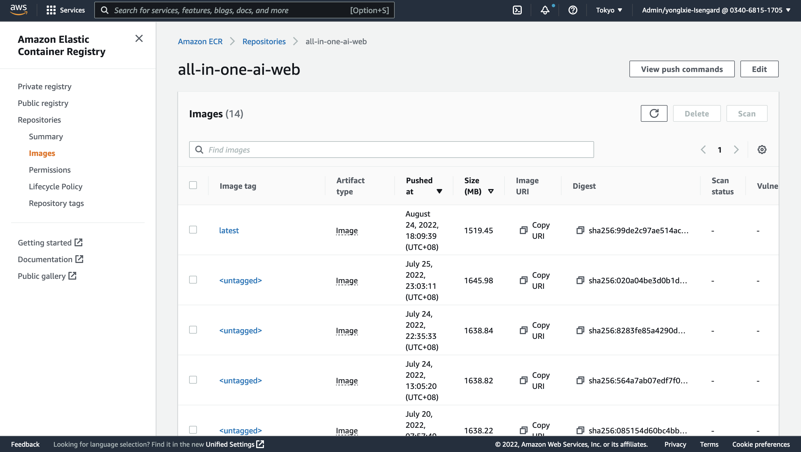
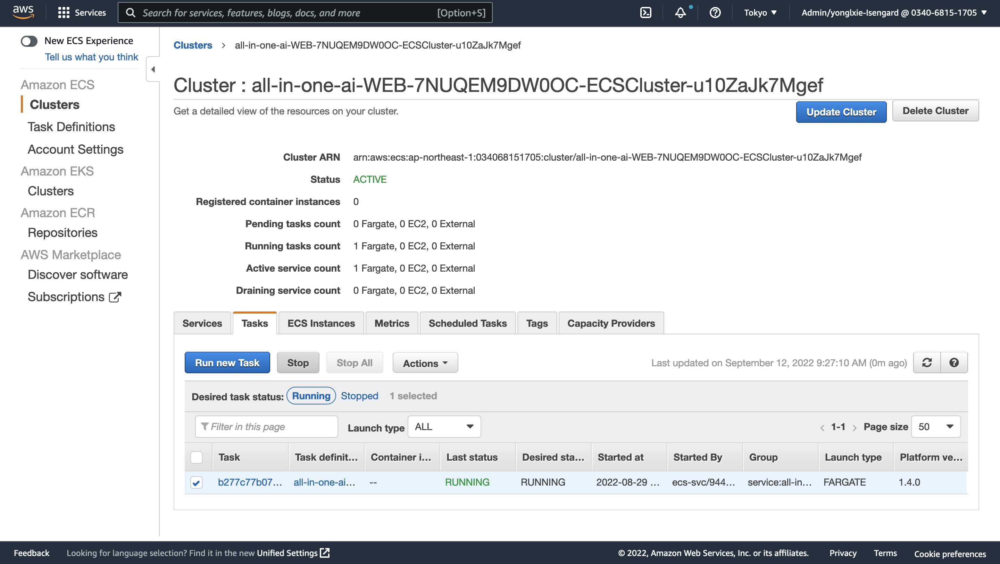

# Builder Guide

## Fully update
-   Delete CloudFormation stack from all-in-one-ai main stack
-   Delete the asserts uploaded to S3 URI.
-   tart a fresh deployment
-   Please refer to quick deployment section in all-in-one-ai-deployment-guide.

##	Partial update
###	CloudFormation update
-   Upload updated CloudFormation templates to S3 via executing the following command where project_dir is the path of all-in-one-ai source and s3uri is the S3 URI where the assets were uploaded to. 

        aws s3 cp ${project_dir}/deployment/templates ${s3uri}/templates --recursive

-   Update CloudFormation stack from all-in-one-ai main stack in CloudFormation console or update CloudFormation nested stack only when you are very familiar with the whole structure of all-in-one-ai and changes between the existed and new one.
    
-   If the CloudFormation stack changes can’t be detected by CloudFormation automatically, you have to replace the source manually. Otherwise, you have to perform fully update.

###	Backend source update
-	Upload updated backend source in ZIP format to S3 via executing the following command where project_dir is the path of all-in-one-ai source and s3uri is the S3 URI where the assets were uploaded to. [Optional]
aws s3 cp ${project_dir}/backend/build/codes ${s3uri}/codes --recursive
-	Go to AWS Lambda console and upload a new revision of Lambda source code in ZIP format.

###	Web source update
-   Build web docker image and push to AWS ECR with following command where project_dir is the path of all-in-one-ai source and region is the AWS region where you launched your web server in AWS ECS.

        cd ${project_dir}/web
        ./build_and_push.sh ${region}

-   Go to AWS ECR console to confirm if the new ECR revision is pushed.

    

    

##  Add a new algorithm – Common
###	Machine learning frameworks supported
-   Apache MXNET
-	HuggingFace
-	PyTorch
-	TensorFlow
###	Machine learning frameworks not supported yet while planned in the near future
-	Chainer
-	Reinforcement Learning
-	Scikit-learn
-	SparkML Serving
-	XGBoost
###	Machine learning frameworks not covered above
-	You may need to use BYOC
-	You may need to build BYOS with supported machine learning frameworks. For example, PaddleOCR uses PaddlePaddle as the underling machine learning framework which is not supported in SageMaker Python SDK. We could reuse a supported machine learning framework. 

    -	PaddleOCR training – TensorFlow
    -	PaddleOCR inference – PyTorch.

##	Add a new algorithm – BYOS
###	SageMaker
-	Add a fold under sagemaker
-	Create your scripts for train and inference
###	Backend
-	Revise backend/src/all_in_one_ai_train/lambda_function.py and add an entry for new algorithm training and choose corresponding machine learning framework. 

        if(algorithm == 'yolov5'):
            default_hyperparameters = {
                'data': '/opt/ml/input/data/cfg/data.yaml', 
                'cfg': 'yolov5s.yaml', 
                'weight': 'yolov5s.pt', 
                'project': '/opt/ml/model/',
                'name': 'tutorial', 
                'img': 640, 
                'batch': 16, 
                'epochs': 100,
                'device': 0
            }
            for key in default_hyperparameters.keys():
                if(key not in hyperparameters.keys()):
                    hyperparameters[key] = default_hyperparameters[key]
            
            git_config = {'repo': 'https://github.com/ultralytics/yolov5.git', 'branch': 'master'}
            
            payload = {
                'body': {
                    'job_name': job_name,
                    'algorithm': algorithm,
                    'industrial_model': industrial_model,
                    'entry_point': 'train.py',
                    'source_dir': '.',
                    'git_config': git_config,
                    'role': role_arn,
                    'instance_type': instance_type,
                    'instance_count': instance_count,
                    'hyperparameters': hyperparameters,
                    'inputs': inputs,
                    'py_version': 'py38',
                    'framework_version': '1.10.2'
                }
            }

            response = lambda_client.invoke(
                FunctionName = 'all_in_one_ai_create_train_pytorch',
                InvocationType = 'Event',
                Payload=json.dumps(payload)
            )

-	Revise backend/src/all_in_one_ai_deploy/lambda_function.py and add an entry for new algorithm training and choose corresponding machine learning framework. 

        if(algorithm == 'yolov5'):            
            source_dir = ssmh.get_parameter('/all_in_one_ai/config/meta/algorithms/{0}/source'.format(algorithm))

            payload = {
                'body': {
                    'industrial_model': industrial_model,
                    'role': role_arn,
                    'entry_point': 'inference.py',
                    'source_dir': source_dir,
                    'py_version': 'py38',
                    'framework_version': '1.10.2',
                    'model_name': model_name,
                    'model_data': model_data_url,
                    'model_environment': model_environment,
                    'endpoint_name': endpoint_name,
                    'instance_type': instance_type,
                    'instance_count': instance_count,
                }
            }

            response = lambda_client.invoke(
                FunctionName = 'all_in_one_ai_create_deploy_pytorch',
                InvocationType = 'Event',
                Payload = json.dumps(payload)
            )

-	Revise backend/src/all_in_one_ai_create_pipeline/lambda_function.py and add an entry for new algorithm training and choose corresponding machine learning framework. 

        if(script_mode):
            if(model_algorithm == 'yolov5'):
                default_hyperparameters = {
                    'data': '/opt/ml/input/data/cfg/data.yaml', 
                    'cfg': 'yolov5s.yaml', 
                    'weight': 'yolov5s.pt', 
                    'project': '/opt/ml/model/',
                    'name': 'tutorial', 
                    'img': 640, 
                    'batch': 16, 
                    'epochs': 10
                }
                training_job_hyperparameters = training_job_hyperparameters
                for key in default_hyperparameters.keys():
                    if(key not in training_job_hyperparameters.keys()):
                        training_job_hyperparameters[key] = default_hyperparameters[key]
                
                git_config = {'repo': 'https://github.com/ultralytics/yolov5.git', 'branch': 'master'}
                entry_point = 'train.py'
                source_dir = '.'
                framework_version = '1.10.2'
                py_version = 'py38'

                estimator = PyTorch(
                    entry_point = entry_point,
                    source_dir = source_dir,
                    git_config = git_config,
                    role = role,
                    hyperparameters = training_job_hyperparameters,
                    framework_version = framework_version, 
                    py_version = py_version,
                    instance_type = training_job_instance_type,
                    instance_count = training_job_instance_count
                )

###	Web
-	Create a tsx file under web/src/components/Form/Demo/Single for demostration of new algorithm.
-	Revise web/src/components/Data/data.ts to add a new entry in ALGORITHMS.

        export const ALGORITHMS = [
            {label: 'Yolov5', value: 'yolov5', reference: 'https://github.com/ultralytics/yolov5/blob/master/README.md', type: 'single', trainable: true}, 
            {label: 'GluonCV', value:'gluoncv', reference: 'https://github.com/dmlc/gluon-cv/blob/master/README.md', type: 'single', trainable: true}, 
            {label: 'GluonTS', value:'gluonts', reference: 'https://github.com/awslabs/gluonts/blob/dev/README.md', type: 'single', trainable: true},
            {label: 'PaddleOCR', value: 'paddleocr', reference: 'https://github.com/PaddlePaddle/PaddleOCR/blob/release/2.6/README.md',type: 'single', trainable: true}, 
            {label: 'CPT', value: 'cpt', reference:'https://github.com/fastnlp/CPT/blob/master/README.md', type: 'single', trainable: true}, 
            {label: 'GABSA', value: 'gabsa', reference: 'https://github.com/IsakZhang/Generative-ABSA/blob/main/readme.md', type: 'single', trainable: true},
            {label: 'PaddleNLP', value: 'paddlenlp', reference: 'https://github.com/PaddlePaddle/PaddleNLP/blob/develop/README_en.md', type: 'single', trainable: true},
            {label: 'mDeBERTa', value: 'mdeberta', reference: 'https://github.com/microsoft/DeBERTa/blob/master/README.md', type: 'single', trainable: false},
            {label: 'KeyBERT', value: 'keybert', reference: 'https://github.com/MaartenGr/KeyBERT/blob/master/README.md',  type: 'single', trainable: false},
            {label: 'Yolov5PaddleOCR', value: 'yolov5paddleocr', type: 'mixed'}
        ]

-	Revise web/src/components/Data/data.ts to add a new entry in TRAININGINPUTDATA.

        export const TRAININGINPUTDATA = {
            'yolov5': [
                {
                    key: 'images',
                    value: ''
                },
                {
                    key: 'labels',
                    value: ''
                },
                {
                    key: 'cfg',
                    value: ''
                },
                {
                    key: 'weights',
                    value: ''
                }
            ],
            'gluoncv': [
                {
                    key: 'train',
                    value: ''
                },
                {
                    key: 'val',
                    value: ''
                },
                {
                    key: 'test',
                    value: ''
                }
            ],
            'cpt': [
                {
                    key: 'dataset',
                    value: ''
                }
            ],
            'gabsa': [
                {
                    key: 'dataset',
                    value: ''
                }
            ],
            'paddlenlp': [
                {
                    key: 'dataset',
                    value: ''
                }
            ],
            'paddleocr': [
                {
                    key: 'dataset',
                    value: ''
                },
                {
                    key: 'pretrained_models',
                    value: ''
                }
            ],
            'gluonts': [
                {
                    key: 'dataset',
                    value: ''
                }
            ]
        }

###	Deployment
-   Revise deployment/templates/all-in-one-ai-ssm.yaml  to add 3 new entries

        Parameter15:
            Type: AWS::SSM::Parameter
            Properties:
            Name: /all_in_one_ai/config/meta/algorithms/yolov5/industrialmodels
            Type: String
            Value: !Sub s3://${S3Bucket}/${S3Key}algorithms/yolov5/industrialmodels/

        Parameter16:
            Type: AWS::SSM::Parameter
            Properties:
            Name: /all_in_one_ai/config/meta/algorithms/yolov5/source
            Type: String
            Value: !Sub s3://${S3Bucket}/${S3Key}algorithms/yolov5/source/sourcedir.tar.gz

        Parameter17:
            Type: AWS::SSM::Parameter
            Properties:
            Name: /all_in_one_ai/config/meta/algorithms/yolov5/artifact
            Type: String
            Value: !Sub s3://${S3Bucket}/${S3Key}algorithms/yolov5/artifact/model.tar.gz

##	Add a new algorithm – BYOC
###	SageMaker
-	Add a folder under sagemaker
-	Create your Dockerfile for training

        FROM nvcr.io/nvidia/pytorch:20.12-py3

        ENV PYTHONDONTWRITEBYTECODE 1
        ENV PYTHONUNBUFFERED 1

        RUN pip install imageio-ffmpeg==0.4.3 pyspng==0.1.0

        # Install sagemaker-training toolkit that contains the common functionality necessary to create a container compatible with SageMaker and the Python SDK.
        RUN pip3 install sagemaker-training

        ENV PATH="/opt/ml/code:${PATH}"

        # /opt/ml and all subdirectories are utilized by SageMaker, we use the /code subdirectory to store our user code.
        COPY stylegan2/ /opt/ml/code/

        # this environment variable is used by the SageMaker PyTorch container to determine our user code directory.
        ENV SAGEMAKER_SUBMIT_DIRECTORY /opt/ml/code

        # this environment variable is used by the SageMaker PyTorch container to determine our program entry point
        # for training and serving.
        # For more information: https://github.com/aws/sagemaker-pytorch-container
        ENV SAGEMAKER_PROGRAM train.py

-	Create your Dockerfile for inference

        FROM nvcr.io/nvidia/pytorch:20.12-py3

        # Set a docker label to advertise multi-model support on the container
        LABEL com.amazonaws.sagemaker.capabilities.multi-models=true
        # Set a docker label to enable container to use SAGEMAKER_BIND_TO_PORT environment variable if present
        LABEL com.amazonaws.sagemaker.capabilities.accept-bind-to-port=true

        ENV PYTHONDONTWRITEBYTECODE 1
        ENV PYTHONUNBUFFERED 1

        RUN pip install imageio-ffmpeg==0.4.3 pyspng==0.1.0

        # Upgrade installed packages
        RUN apt-get update && apt-get upgrade -y && apt-get clean

        # Install necessary dependencies for MMS and SageMaker Inference Toolkit
        RUN apt-get -y install --no-install-recommends \
            build-essential \
            ca-certificates \
            openjdk-8-jdk-headless \
            curl \
            vim \
            && rm -rf /var/lib/apt/lists/

        # Install MXNet, MMS, and SageMaker Inference Toolkit to set up MMS
        RUN pip3 --no-cache-dir install mxnet \
                                        multi-model-server \
                                        sagemaker-inference \
                                        retrying \
                                        sagemaker \
                                        smdebug

        ENV PATH="/opt/ml/code:${PATH}"

        RUN mkdir -p /opt/ml/code

        # /opt/ml and all subdirectories are utilized by SageMaker, we use the /code subdirectory to store our user code.
        COPY stylegan2/ /opt/ml/code/

        # Copy entrypoint script to the image
        COPY dockerd-entrypoint.py /usr/local/bin/dockerd-entrypoint.py
        RUN chmod +x /usr/local/bin/dockerd-entrypoint.py

        # Define an entrypoint script for the docker image
        ENTRYPOINT ["python", "/usr/local/bin/dockerd-entrypoint.py"]

        # Define command to be passed to the entrypoint
        CMD ["serve"]

-	Create your build_and_push.sh and change the image default name

        #!/bin/bash
        set -v
        set -e

        # This script shows how to build the Docker image and push it to ECR to be ready for use
        # by SageMaker.

        # The argument to this script is the region name. 

        if [ "$#" -ne 1 ]; then
            echo "usage: $0 [region-name]"
            exit 1
        fi

        region=$1

        # Get the account number associated with the current IAM credentials
        account=$(aws sts get-caller-identity --query Account --output text)

        if [ $? -ne 0 ]
        then
            exit 255
        fi

        training_image=all-in-one-ai-stylegan-training
        training_fullname=${account}.dkr.ecr.${region}.amazonaws.com/${training_image}:latest

        # If the repository doesn't exist in ECR, create it.
        aws ecr describe-repositories --repository-names "${training_image}" --region ${region} || aws ecr create-repository --repository-name "${training_image}" --region ${region}

        if [ $? -ne 0 ]
        then
            aws ecr create-repository --repository-name "${training_image}" --region ${region}
        fi

        # Get the login command from ECR and execute it directly
        aws ecr get-login-password --region $region | docker login --username AWS --password-stdin $account.dkr.ecr.$region.amazonaws.com

        aws ecr set-repository-policy \
            --repository-name "${training_image}" \
            --policy-text "file://ecr-policy.json" \
            --region ${region}

        # Build the docker image locally with the image name and then push it to ECR
        # with the full name.

        docker build -t ${training_image} -f Dockerfile.training .

        docker tag ${training_image} ${training_fullname}

        docker push ${training_fullname}

        inference_image=all-in-one-ai-stylegan-inference
        inference_fullname=${account}.dkr.ecr.${region}.amazonaws.com/${inference_image}:latest

        # If the repository doesn't exist in ECR, create it.
        aws ecr describe-repositories --repository-names "${inference_image}" --region ${region} || aws ecr create-repository --repository-name "${inference_image}" --region ${region}

        if [ $? -ne 0 ]
        then
            aws ecr create-repository --repository-name "${inference_image}" --region ${region}
        fi

        # Get the login command from ECR and execute it directly
        aws ecr get-login-password --region $region | docker login --username AWS --password-stdin $account.dkr.ecr.$region.amazonaws.com

        aws ecr set-repository-policy \
            --repository-name "${inference_image}" \
            --policy-text "file://ecr-policy.json" \
            --region ${region}

        # Build the docker image locally with the image name and then push it to ECR
        # with the full name.

        docker build -t ${inference_image} -f Dockerfile.inference . 

        docker tag ${inference_image} ${inference_fullname}

        docker push ${inference_fullname}

###	Backend
-	Please refer to backend/src/all_in_one_ai_training_job/lambda_function.py. No changes needed as long as the default training_image was put in SSM parameter store.

        if(training_image == ''):
	        try: 
	            training_image = ssmh.get_parameter('/all_in_one_ai/config/meta/algorithms/{0}/training_image'.format(algorithm))
	        except Exception as e:
	            print(e)

-	Please refer to backend/src/all_in_one_ai_model/lambda_function. No changes needed as long as the default infernece_image and artifact was put in SSM parameter store.

        if(training_image == ''):
	        try: 
	            training_image = ssmh.get_parameter('/all_in_one_ai/config/meta/algorithms/{0}/training_image'.format(algorithm))
	        except Exception as e:
	            rint(e)

        if(model_data_url == ''):
            try: 
                model_data_url = ssmh.get_parameter('/all_in_one_ai/config/meta/algorithms/{0}/artifact'.format(algorithm))
            except Exception as e:
                print(e)

    default model_data_url is only valid for the model which doesn’t need to download the model data.

-	Revise backend/src/all_in_one_ai_train/lambda_function.py and add an entry for new algorithm training and choose corresponding machine learning framework. 

        elif(algorithm == 'stylegan'):
            image_uri = ssmh.get_parameter('/all_in_one_ai/config/meta/algorithms/{0}/training_image'.format(algorithm))

            default_hyperparameters = {
                'outdir': '/opt/ml/model',
                'gpus': 1,
                'kimg': 1000
            }

            for key in default_hyperparameters.keys():
                if(key not in hyperparameters.keys()):
                    hyperparameters[key] = default_hyperparameters[key]

            payload = {
                'body': {
                    'job_name': job_name,
                    'industrial_model': industrial_model,
                    'role': role_arn,
                    'image_uri': image_uri,
                    'instance_type': instance_type,
                    'instance_count': instance_count,
                    'hyperparameters': hyperparameters,
                    'inputs': inputs
                }
            }

            response = lambda_client.invoke(
                FunctionName = 'all_in_one_ai_create_train_generic',
                InvocationType = 'Event',
                Payload=json.dumps(payload)
            )

-	Revise backend/src/all_in_one_ai_deploy/lambda_function.py and add an entry for new algorithm training and choose corresponding machine learning framework. 

        elif(algorithm == 'stylegan'):
            image_uri = ssmh.get_parameter('/all_in_one_ai/config/meta/algorithms/{0}/inference_image'.format(algorithm))
            
            payload = {
                'body': {
                    'industrial_model': industrial_model,
                    'role': role_arn,
                    'model_name': model_name,
                    'image_uri': image_uri,
                    'model_data': model_data_url,
                    'model_environment': model_environment,
                    'endpoint_name': endpoint_name,
                    'instance_type': instance_type,
                    'instance_count': instance_count,
                }
            }

            response = lambda_client.invoke(
                FunctionName = 'all_in_one_ai_create_deploy_generic',
                InvocationType = 'Event',
                Payload = json.dumps(payload)
            )

-	Revise backend/src/all_in_one_ai_create_pipeline/lambda_function.py and add an entry for new algorithm training and choose corresponding machine learning framework. 

        elif(model_algorithm == 'stylegan'):
            image_uri = ssmh.get_parameter('/all_in_one_ai/config/meta/algorithms/{0}/training_image'.format(model_algorithm))

            default_hyperparameters = {
                'outdir': '/opt/ml/model',
                'gpus': 1,
                'kimg': 1000
            }

            for key in default_hyperparameters.keys():
                if(key not in training_job_hyperparameters.keys()):
                    training_job_hyperparameters[key] = default_hyperparameters[key]

            estimator = Estimator(
                role = role,
                instance_count = training_job_instance_count,
                instance_type = training_job_instance_type,
                image_uri = image_uri,
                hyperparameters=training_job_hyperparameters
            )

###	Web
-	Create a tsx file under web/src/components/Form/Demo/Single for demostration of new algorithm.
-	Revise web/src/components/Data/data.ts to add a new entry in ALGORITHMS.

        export const ALGORITHMS = [
            {label: 'Yolov5', value: 'yolov5', reference: 'https://github.com/ultralytics/yolov5/blob/master/README.md', type: 'single', trainable: true, inferable: true, batchannotation: true}, 
            {label: 'GluonCV', value:'gluoncv', reference: 'https://github.com/dmlc/gluon-cv/blob/master/README.md', type: 'single', trainable: true, inferable: true, batchannotation: false}, 
            {label: 'GluonTS', value:'gluonts', reference: 'https://github.com/awslabs/gluonts/blob/dev/README.md', type: 'single', trainable: true, inferable: true, batchannotation: false},
            {label: 'PaddleOCR', value: 'paddleocr', reference: 'https://github.com/PaddlePaddle/PaddleOCR/blob/release/2.6/README.md',type: 'single', trainable: true, inferable: true, batchannotation: false}, 
            {label: 'CPT', value: 'cpt', reference:'https://github.com/fastnlp/CPT/blob/master/README.md', type: 'single', trainable: true, inferable: true, batchannotation: false}, 
            {label: 'GABSA', value: 'gabsa', reference: 'https://github.com/IsakZhang/Generative-ABSA/blob/main/readme.md', type: 'single', trainable: true, inferable: true, batchannotation: false},
            {label: 'PaddleNLP', value: 'paddlenlp', reference: 'https://github.com/PaddlePaddle/PaddleNLP/blob/develop/README_en.md', type: 'single', trainable: true, inferable: true, batchannotation: false},
            {label: 'mDeBERTa', value: 'mdeberta', reference: 'https://github.com/microsoft/DeBERTa/blob/master/README.md', type: 'single', trainable: false, inferable: true, batchannotation: false},
            {label: 'KeyBERT', value: 'keybert', reference: 'https://github.com/MaartenGr/KeyBERT/blob/master/README.md',  type: 'single', trainable: false, inferable: true, batchannotation: false},
            {label: 'StyleGAN2', value: 'stylegan', reference: 'https://github.com/NVlabs/stylegan2-ada-pytorch/blob/main/README.md',  type: 'single', trainable: true, inferable: true, batchannotation: false},
            {label: 'Generic', value: 'generic', type: 'single', trainable: false, inferable: false, batchannotation: true},
            {label: 'Yolov5PaddleOCR', value: 'yolov5paddleocr', type: 'mixed', trainable: false, inferable: false, batchannotation: false}

-	Revise web/src/components/Data/data.ts to add a new entry in TRAININGINPUTDATA.

        export const TRAININGINPUTDATA = {
            'yolov5': [
                {
                    key: 'images',
                    value: ''
                },
                {
                    key: 'labels',
                    value: ''
                },
                {
                    key: 'cfg',
                    value: ''
                },
                {
                    key: 'weights',
                    value: ''
                }
            ],
            'gluoncv': [
                {
                    key: 'train',
                    value: ''
                },
                {
                    key: 'val',
                    value: ''
                },
                {
                    key: 'test',
                    value: ''
                }
            ],
            'cpt': [
                {
                    key: 'dataset',
                    value: ''
                }
            ],
            'gabsa': [
                {
                    key: 'dataset',
                    value: ''
                }
            ],
            'paddlenlp': [
                {
                    key: 'dataset',
                    value: ''
                }
            ],
            'paddleocr': [
                {
                    key: 'dataset',
                    value: ''
                },
                {
                    key: 'pretrained_models',
                    value: ''
                }
            ],
            'gluonts': [
                {
                    key: 'dataset',
                    value: ''
                }
            ],
            'stylegan': [
                {
                    key: 'data',
                    value: ''
                },
                {
                    key: 'gpus',
                    value: ''
                },
                {
                    key: 'kimg',
                    value: ''
                }
            ]
        }

###	Deployment
-	It will be done automatically as long as it is put under sagemaker subdirectory with Dockerfile and build_and_push.sh

            dirlist=$(find ${project_dir}/sagemaker -mindepth 1 -maxdepth 1 -type d)
            for subdir in $dirlist
            do
                if [ -f "./build_and_push.sh" ]; 
                then
                    ./build_and_push.sh ${region}
                    touch dummy
                    tar czvf model.tar.gz dummy
                    aws s3 cp model.tar.gz ${s3uri}/algorithms/${algorithm}/artifact/
                    rm dummy
                    rm model.tar.gz        
                else
                    cd ${subdir}
                    array=($(echo ${subdir} | tr "/" "\n"))
                    size=${#array[@]}
                    index=$((size - 1))
                    algorithm=${array[$index]}
                    touch dummy
                    tar czvf model.tar.gz dummy
                    aws s3 cp model.tar.gz ${s3uri}/algorithms/${algorithm}/artifact/
                    rm dummy
                    rm model.tar.gz
                    tar czvf sourcedir.tar.gz *
                    aws s3 cp sourcedir.tar.gz ${s3uri}/algorithms/${algorithm}/source/
                    rm sourcedir.tar.gz
                fi
            done

-   Revise deployment/templates/all-in-one-ai-ssm.yaml  to add new entries for your default training image and inference image

        Parameter40:
            Type: AWS::SSM::Parameter
            Properties:
            Name: /all_in_one_ai/config/meta/algorithms/stylegan/industrialmodels
            Type: String
            Value: !Sub s3://${S3Bucket}/${S3Key}algorithms/stylegan/industrialmodels/

        Parameter41:
            Type: AWS::SSM::Parameter
            Properties:
            Name: /all_in_one_ai/config/meta/algorithms/stylegan/training_image
            Type: String
            Value:
                !If
                - Globally
                - !Sub ${AWS::AccountId}.dkr.ecr.${AWS::Region}.amazonaws.com/all-in-one-ai-stylegan-training:latest
                - !Sub ${AWS::AccountId}.dkr.ecr.${AWS::Region}.amazonaws.com.cn/all-in-one-ai-stylegan-training:latest

        Parameter42:
            Type: AWS::SSM::Parameter
            Properties:
            Name: /all_in_one_ai/config/meta/algorithms/stylegan/inference_image
            Type: String
            Value:
                !If
                - Globally
                - !Sub ${AWS::AccountId}.dkr.ecr.${AWS::Region}.amazonaws.com/all-in-one-ai-stylegan-inference:latest
                - !Sub ${AWS::AccountId}.dkr.ecr.${AWS::Region}.amazonaws.com.cn/all-in-one-ai-stylegan-inference:latest