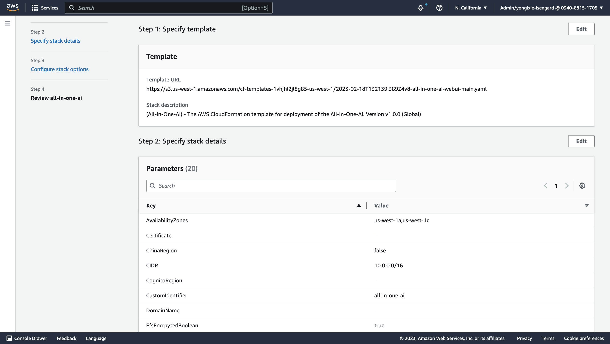
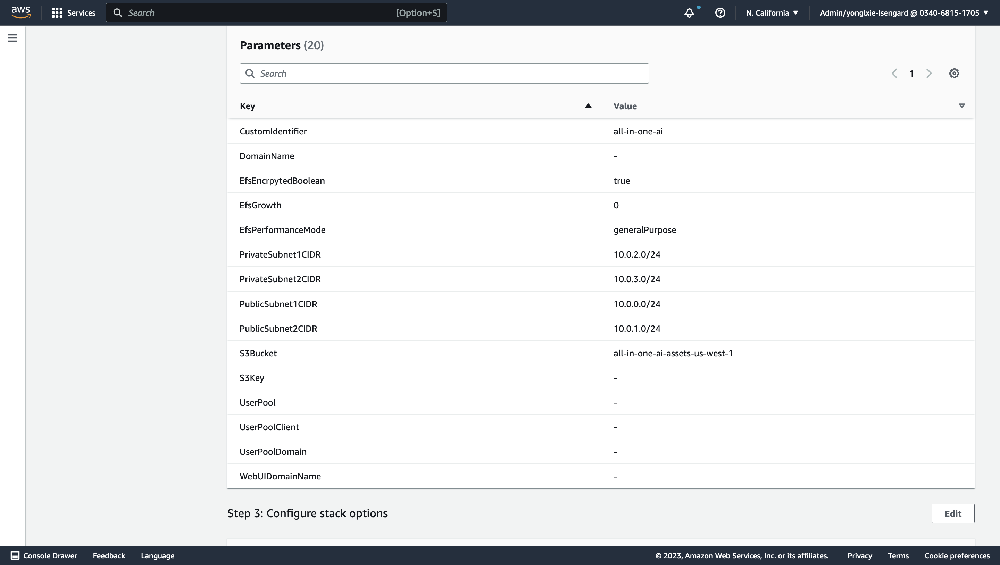
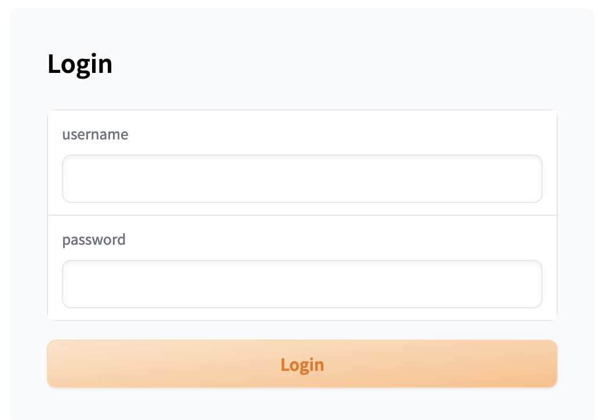

## Toolkits to be prepared prior to build and deploy
-   git
-   awscli
-   zip
-   python3
-   pip3
-   docker
-   jq
-   s5cmd

##  Build stable-diffusion-webui (Fully)

Change directory to [path-to-all-in-one-ai]/deployment and run the following commands to package python codes and build docker image for web portal and then upload assets to S3 and push docker image to ECR which region is the same AWS region as where CloudFormation stack. It will may take 15-30 minutes. Parameters s3uri and aws-region are mandatory while parameter algorithm is optional to specify which algorithm will be built-in and if it is not presented, all of algorithms will be built-in.

    cd [path-to-all-in-one-ai]/deployment

    ./build_and_deploy.sh [s3uri] [aws-region] stable-diffusion-webui

##  Build stable-diffusion-webui (Partially)

Go to sagemaker/stable-diffusion-webui and run the following command.
    
    cd [path-to-all-in-one-ai]/sagemaker/stable-diffusion-webui

    run ./build_and_push.sh [region-name]

Note: It is a partial step of build_and_deploy.sh and it is only used to partially update stable-diffusion-webui or run Jupyter Notebooks of stable-diffusion-webui directly.

##  Deploy stable-diffusion-webui

1.  Launch CloudFormation stack template by clicking  , and input Amazon S3 URL with HTTP URI of all-in-one-ai-webui-main.yaml.

    

2. Specify stack details. Please select at least 2 availability zone, Certificate, DomainName, input S3 bucket/key information of your stack template, input CognitoRegion, UserPool, UserPoolClient, UserPoolDomain if Cognito authentication is enabled and customize other parameters if needed. Choose Next.

    

        

    

3. Configure stack options. Keep everything as default and choose Next.

    

    

4.  Review stack all-in-one-ai. Check the 1 check boxes in the bottom. Choose Create Stack.

    

    

    

    

    

5.  Wait for around 15 minutes to get the stack launched and check the stack outpus.

    

###  Prepare models
*   SD v2.1

    [768-v-ema.ckpt](https://huggingface.co/stabilityai/stable-diffusion-2-1/blob/main/v2-1_768-ema-pruned.ckpt)

    [stable-diffusion/v2-inference-v.yaml](https://github.com/Stability-AI/stablediffusion/blob/main/configs/stable-diffusion/v2-inference-v.yaml)

*   SD v2.0
    
    [768-v-ema.ckpt](https://huggingface.co/stabilityai/stable-diffusion-2/blob/main/768-v-ema.ckpt)

    [stable-diffusion/v2-inference-v.yaml](https://github.com/Stability-AI/stablediffusion/blob/main/configs/stable-diffusion/v2-inference-v.yaml)

*   SD v1.5
    
    [v1-5-pruned-emaonly.ckpt](https://huggingface.co/runwayml/stable-diffusion-v1-5/blob/main/v1-5-pruned-emaonly.ckpt)

    [v1-5-pruned.ckpt](https://huggingface.co/runwayml/stable-diffusion-v1-5/blob/main/v1-5-pruned.ckpt)

*   SD v1.4
    
    [sd-v1-4-full-ema.ckpt](https://huggingface.co/CompVis/stable-diffusion-v-1-4-original/blob/main/sd-v1-4-full-ema.ckpt)

    [sd-v1-4.ckpt](https://huggingface.co/CompVis/stable-diffusion-v-1-4-original/blob/main/sd-v1-4.ckpt)

*   ControlNet
    [pre-trained ControlNet models](https://huggingface.co/lllyasviel/ControlNet/tree/main/models)

You could pick up all your interested SD models and download them and organize the directory structure as following. You will need to put your SD models to assets/Stable-diffusion and models and put your pre-trained ControlNet models to assets/ControlNet. 
    
    --[path-to-model-preparation-directory]
       --assets
         --Stable-diffusion
         --ControlNet
       --models

You will need to run the following commands.

    cd [path-to-model-preparation-directory]/assets
    tar czvf model.tar.gz Stable-diffusion ControlNet
    cd [path-to-model-preparation-direcotry]
    python3 prepare.sh

This script will help to push assets/model.tar.gz to s3://[sagemaker-default-bucket]/assets/, push the models directory to s3://[sagemaker-default-bucket]/models/.

For instance, the following diagram shows the model files at s3://[sagemaker-default-bucket]/models/.

Note:

*   For SD v2.0, please keep the filename consistent, e.g. 768-v-ema.ckpt and 768-v-ema.yaml.

*   Only English versions of SD 2.x and SD 1.x are supported. Chinese versions (e.g. Taiyi) are not supported yet.

## Launch stable-diffusion-webui

*   Wait 10 minutes until the stable-diffusion-webui server pass the health check and then check the stack outputs of all-in-one-ai-webui and then launch the stable-diffusion-webui. 

*   You will need to run your secretmanager.sh script to get your username/password where your-secret-id is one of your CloudFormation stack's output.

        cd [path-to-all-in-one-ai]/sagemaker/stable-diffusion-webui/tools
        ./secretmanager.sh [your-secret-id] [region] get

*   You will be asked to input username/password for eligibility check to use this stable-diffusion-webui. Here username/password could be either from the above step with secretmanager.sh or from your admin user who will manage users.

*   Admin user will be able to manager users, e.g. users creation / update / deletion.

*   Normal users will be able to use stable-diffusion-webui for normal image generation tasks.

*   You can switch users by clicking Logout button.

## Setup stable-diffusion-webui

*   Configure your SageMaker endpoint and your stable diffusion models

    Select your SageMaker endpoint firstly from dropdown list of avaiable SageMaker endpoints list. You may refresh the available SageMaker endpoints list by clicking refresh button right after SageMaker endpoints dropdown list. Then refresh stable diffusion models by clicking refresh button right after stable diffusion models and choose your stable diffusion model.

    

    

## Quickstart

### Create industrial model

It will be created by default if you have started stable-diffusion-webui once. Alternative you can create it explicitly. Note industrial model of stable-diffusion-webui is unique within one all-in-one-ai app and with name 'stable-diffusion-webui' by design.

### Quickstart - train

Basically we support 3 train approach instable-diffusion-webui: embedding, hypernetwork, and dreambooth which can be used to train person, object, style.

Strongly recommend that you start the training job inside of stable-diffusion-webui since it is already supported with more friendely user interface. 

Alternative you start the training job explicitly. 

**Hyperparameters**

| Hyperparameter | Default value | Comment |
|---|---|---|
|region|Current region name|AWS region name|
|embeddings-s3uri|s3://[sagemaker-default-bucket]/stable-diffusion-webui/embeddings/|S3 URI of embeddings, only applicable for embedding or hypernetwork training|
|hypernetwork-s3uri|s3://[sagemaker-default-bucket]/stable-diffusion-webui/hypernetwork/|S3 URI of hypernetwork, only applicable for embedding or hypernetwork training|
|train-task|embedding|One of embedding, hypernetwork, dreambooth|
|api-endpoint|REST API Gateway of all-in-one-ai|REST API Gateway|
|db-models-s3uri|s3://[sagemaker-default-bucket]/stable-diffusion-webui/dreambooth/|S3 URI of dreambooth model S3 URI, only applicable for dreambooth training|
|sd-models-s3uri|s3://[sagemaker-default-bucket]/stable-diffusion-webui/models/|stable diffusion models S3 URI, only applicable for dreambooth training|
|train-args|train-args which is up to train-task|
|dreambooth-config-id|dreambooth config id which is used to identify the dreambooth config in s3://[sagemaker-default-bucket]/stable-diffusion-webui/dreambooth-config/|

**train-args example for train dreambooth**

    {\"train_dreambooth_settings\": {\"db_create_new_db_model\": true, \"db_new_model_name\": \"my-awsdogtoy-model-002\", \"db_new_model_src\": \"768-v-ema.ckpt\", \"db_new_model_scheduler\": \"ddim\", \"db_create_from_hub\": false, \"db_new_model_url\": \"\", \"db_new_model_token\": \"\", \"db_new_model_extract_ema\": false, \"db_model_name\": \"\", \"db_lora_model_name\": \"\", \"db_lora_weight\": 1, \"db_lora_txt_weight\": 1, \"db_train_imagic_only\": false, \"db_use_subdir\": false, \"db_custom_model_name\": \"\", \"db_train_wizard_person\": false, \"db_train_wizard_object\": true, \"db_performance_wizard\": true}}

**dreambooth-config example for train dreambooth**

    """
    model_name: str = "",
    adam_beta1: float = 0.9,
    adam_beta2: float = 0.999,
    adam_epsilon: float = 1e-8,
    adam_weight_decay: float = 0.01,
    attention: str = "default",
    center_crop: bool = True,
    concepts_path: str = "",
    custom_model_name: str = "",
    epoch_pause_frequency: int = 0,
    epoch_pause_time: int = 0,
    gradient_accumulation_steps: int = 1,
    gradient_checkpointing: bool = True,
    half_model: bool = False,
    has_ema: bool = False,
    hflip: bool = False,
    learning_rate: float = 0.00000172,
    lora_learning_rate: float = 1e-4,
    lora_txt_learning_rate: float = 5e-5,
    lr_scheduler: str = 'constant',
    lr_warmup_steps: int = 0,
    max_token_length: int = 75,
    max_train_steps: int = 1000,
    mixed_precision: str = "fp16",
    model_path: str = "",
    not_cache_latents=False,
    num_train_epochs: int = 1,
    pad_tokens: bool = True,
    pretrained_vae_name_or_path: str = "",
    prior_loss_weight: float = 1.0,
    resolution: int = 512,
    revision: int = 0,
    sample_batch_size: int = 1,
    save_class_txt: bool = False,
    save_embedding_every: int = 500,
    save_preview_every: int = 500,
    save_use_global_counts: bool = False,
    save_use_epochs: bool = False,
    scale_lr: bool = False,
    scheduler: str = "ddim",
    src: str = "",
    shuffle_tags: bool = False,
    train_batch_size: int = 1,
    train_text_encoder: bool = True,
    use_8bit_adam: bool = True,
    use_concepts: bool = False,
    use_cpu: bool = False,
    use_ema: bool = True,
    use_lora: bool = False,
    v2: bool = False,
    c1_class_data_dir: str = "",
    c1_class_guidance_scale: float = 7.5,
    c1_class_infer_steps: int = 60,
    c1_class_negative_prompt: str = "",
    c1_class_prompt: str = "",
    c1_class_token: str = "",
    c1_instance_data_dir: str = "",
    c1_instance_prompt: str = "",
    c1_instance_token: str = "",
    c1_max_steps: int = -1,
    c1_n_save_sample: int = 1,
    c1_num_class_images: int = 0,
    c1_sample_seed: int = -1,
    c1_save_guidance_scale: float = 7.5,
    c1_save_infer_steps: int = 60,
    c1_save_sample_negative_prompt: str = "",
    c1_save_sample_prompt: str = "",
    c1_save_sample_template: str = "",
    c2_class_data_dir: str = "",
    c2_class_guidance_scale: float = 7.5,
    c2_class_infer_steps: int = 60,
    c2_class_negative_prompt: str = "",
    c2_class_prompt: str = "",
    c2_class_token: str = "",
    c2_instance_data_dir: str = "",
    c2_instance_prompt: str = "",
    c2_instance_token: str = "",
    c2_max_steps: int = -1,
    c2_n_save_sample: int = 1,
    c2_num_class_images: int = 0,
    c2_sample_seed: int = -1,
    c2_save_guidance_scale: float = 7.5,
    c2_save_infer_steps: int = 60,
    c2_save_sample_negative_prompt: str = "",
    c2_save_sample_prompt: str = "",
    c2_save_sample_template: str = "",
    c3_class_data_dir: str = "",
    c3_class_guidance_scale: float = 7.5,
    c3_class_infer_steps: int = 60,
    c3_class_negative_prompt: str = "",
    c3_class_prompt: str = "",
    c3_class_token: str = "",
    c3_instance_data_dir: str = "",
    c3_instance_prompt: str = "",
    c3_instance_token: str = "",
    c3_max_steps: int = -1,
    c3_n_save_sample: int = 1,
    c3_num_class_images: int = 0,
    c3_sample_seed: int = -1,
    c3_save_guidance_scale: float = 7.5,
    c3_save_infer_steps: int = 60,
    c3_save_sample_negative_prompt: str = "",
    c3_save_sample_prompt: str = "",
    c3_save_sample_template: str = "",
    concepts_list=None
    """

    [
        "",
        0.9,
        0.999,
        1e-08,
        0.01,
        "default",
        False,
        "",
        "",
        0.0,
        60.0,
        1,
        True,
        False,
        "",
        True,
        2e-06,
        0.0002,
        0.0002,
        "constant",
        500,
        75,
        0,
        "no",
        "",
        True,
        100,
        True,
        "",
        1,
        512,
        "",
        1,
        True,
        500,
        500,
        True,
        False,
        False,
        "",
        "",
        False,
        1,
        True,
        False,
        False,
        False,
        False,
        False,
        "",
        "",
        7.5,
        40,
        "",
        "",
        "photo of dog",
        "/opt/ml/input/data/concepts/images",
        "",
        "photo of awsdogtoy dog",
        -1,
        1,
        0,
        -1,
        7.5,
        40,
        "",
        "",
        "",
        "",
        7.5,
        40,
        "",
        "",
        "",
        "",
        "",
        "",
        -1,
        1,
        0,
        -1,
        7.5,
        40,
        "",
        "",
        "",
        "",
        7.5,
        40,
        "",
        "",
        "",
        "",
        "",
        "",
        -1,
        1,
        0,
        -1,
        7.5,
        40,
        "",
        "",
        ""
    ]

**Input data configuration**

| Channel name | Mandatory | Comment |
|---|---|---|
| images | Yes | S3 URI of images |
| models | No | S3 URI of stable diffusion models |
| embedding | No | S3 URI of embeddings |
| hypernetwork | No | S3 URI of hypernetwork |
| lora | No | S3 URI of lora models |
| dreambooth | No | S3 URI of dreambooth models |

### Quickstart - deploy

**Environment variables**

| Environment variable | Default value | Comment |
|---|---|---|
|api_endpoint|REST API Gateway of all-in-one-ai|REST API Gateway|
|endpoint_name||Name of SageMaker Endpoint which is be used to host stable diffusion models and generate images|

### Quickstart - Inference - Text to Image

**HTTP request**

    payload = {
        'enable_hr': False, 
        'denoising_strength': 0.7, 
        'firstphase_width': 0, 
        'firstphase_height': 0, 
        'prompt': "dog", 
        'styles': ['None', 'None'], 
        'seed': -1, 
        'subseed': -1, 
        'subseed_strength': 0.0, 
        'seed_resize_from_h': 0, 
        'seed_resize_from_w': 0, 
        'sampler_name': None, 
        'batch_size': 1, 
        'n_iter':1, 
        'steps': 20, 
        'cfg_scale': 7.0, 
        'width': 768, 
        'height': 768, 
        'restore_faces': False, 
        'tiling': False, 
        'negative_prompt': '', 
        'eta': 1.0, 
        's_churn': 0.0, 
        's_tmax': None, 
        's_tmin': 0.0, 
        's_noise': 1.0, 
        'override_settings': {}, 
        'script_args': '[0, false, false, false, "", 1, "", 0, "", true, false, false]', 
        'sampler_index': 'Euler a'
    }

    inputs = {
        'task': 'text-to-image',
        'txt2img_payload': payload,
        'username': 'e'
    }

**HTTP response**

    {
        "images" : [
            [base64 encoded images],
            ...,
            [base64 encoded images]
        ]
    }

### Quickstart - Inference - Image to Image

**HTTP request**

    payload = {
        'init_images': [image_encoded_in_base64],
        'resize_mode': 0, 
        'denoising_strength': 0.75, 
        'mask': None, 
        'mask_blur': 4, 
        'inpainting_fill': 1, 
        'inpaint_full_res': False, 
        'inpaint_full_res_padding': 32, 
        'inpainting_mask_invert': 0, 
        'prompt': 'cat', 
        'styles': ['None', 'None'], 
        'seed': -1, 
        'subseed': -1, 
        'subseed_strength': 0.0, 
        'seed_resize_from_h': 0, 
        'seed_resize_from_w': 0, 
        'sampler_name': None, 
        'batch_size': 1, 
        'n_iter': 1, 
        'steps': 20, 
        'cfg_scale': 7.0, 
        'width': 768, 
        'height': 768, 
        'restore_faces': False, 
        'tiling': False, 
        'negative_prompt': '', 
        'eta': 1.0, 
        's_churn': 0.0, 
        's_tmax': None, 
        's_tmin': 0.0, 
        's_noise': 1.0, 
        'override_settings': {}, 
        'script_args': '[0, "<ul>\\n<li><code>CFG Scale</code> should be 2 or lower.</li>\\n</ul>\\n", true, true, "", "", true, 50, true, 1, 0, false, 4, 1, "
Recommended settings: Sampling Steps: 80-100, Sampler: Euler a, Denoising strength: 0.8
", 128, 8, ["left", "right", "up", "down"], 1, 0.05, 128, 4, 0, ["left", "right", "up", "down"], false, false, false, "", "
Will upscale the image to twice the dimensions; use width and height sliders to set tile size
", 64, 0, 1, "", 0, "", true, false, false]', 
        'sampler_index': 'Euler a', 
        'include_init_images': False
    }

    inputs = {
        'task': 'image-to-image',
        'img2img_payload': payload,
        'username': 'e'
    }

**HTTP response**

    {
        "images" : [
            [base64 encoded images],
            ...,
            [base64 encoded images]
        ]
    }

##  Resource Cleanup
*   The resource created by CloudFormation will be deleted automatically when you delete CloudFormation stack. Before you delete CloudFormation stack, please make sure the following resources created dynamically are deleted.

*   Go to [AWS SageMaker Console](https://console.aws.amazon.com/sagemaker/home), make sure all of model, endpoint config, and endpoint which were dynamically created are deleted.
